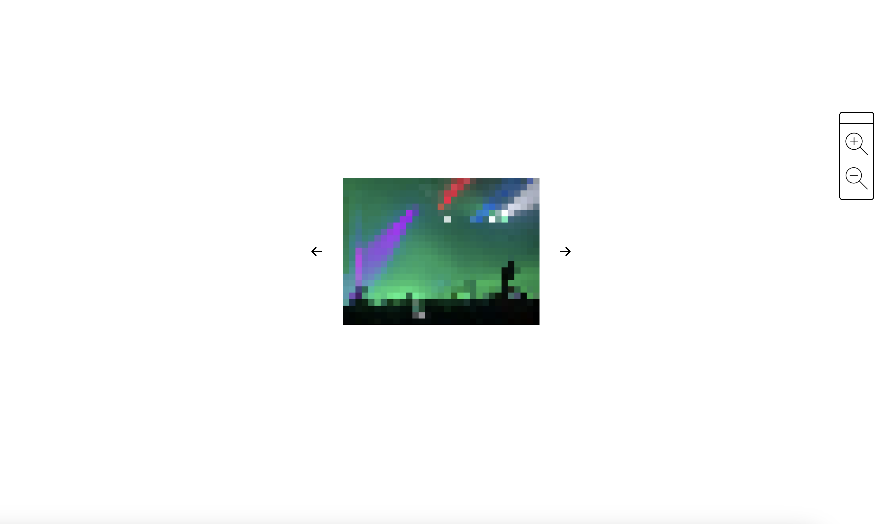
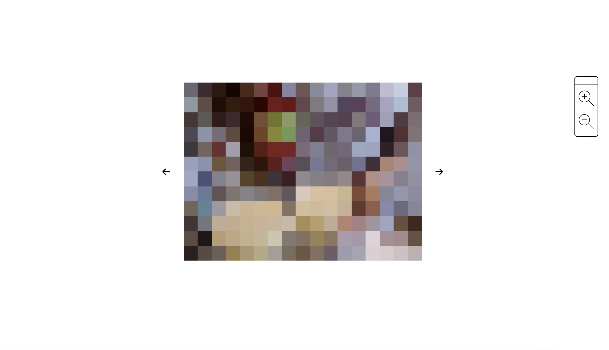
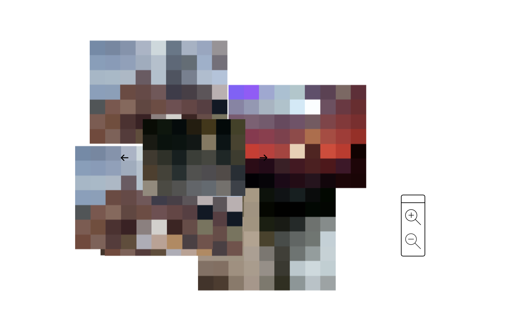

# Against Access
 
An interactive, web-based video archive built from personal camera roll footage. The more you engage with it, the less legible it becomes.

## Try it here!
**[Live demo](https://oceanedaumasson.github.io/Against-Access)**

## Screenshots

## About
Against Access examines the tension between intimacy and exposure in digital spaces. It starts from a common assumption: that making parts of your life visible online means giving up complete access to them. The piece pushes back on that expectation of transparency. Through its interactivity and a gradual shift toward abstraction, increased engagement becomes increased illegibility of the original footage.
 
## Concept
Digital spaces can expose and conceal at the same time. Against Access uses image degradation, interaction, and a deliberately misleading interface to resist full visibility, allowing a form of self-representation that stays partially inaccessible. It argues for a digital environment where identity is not assumed to be fully knowable through what is presented online.
 
The project draws on new media theory:
- **Hito Steyerl's "poor image":** degraded, compressed images that circulate widely
- **Legacy Russell's glitch feminism:** glitch as a form of refusal and resistance
- **Alexander Galloway's interface theory:** the interface as an active force that shapes how media is experienced, not a neutral tool

## Features
- Navigation-driven interactive interface
- Real-time pixelation, distortion, and displacement
- Progressive degradation tied to how often you interact

## Built with
JavaScript, HTML, CSS
